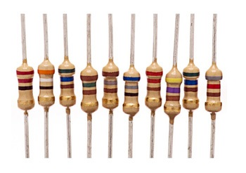

## Hola de Reporte Experimento 01

\section{Resistencias, el Multímetro y la Ley de Ohm}

\begin{tabular}{l r}
Nombre: Angel L Garcia row & ID: 802-17-6928 \\
Nombre: Kevin  & ID: 802-- \\
Sección: 060, 066, 070 & Instructor: Malvin Santos \\
\end{tabular}

### Tabla A-1 Resistencias Fijas

<!-- Llenar tabla -->

| Nominal                       | 22 Ω    | 39 Ω    | 560 Ω    | 150 Ω    | 180 Ω    | 220 Ω   | 470 Ω    | 560 Ω    | 820 Ω    |
| :--                           | :--     | :--     | :--      | :--      | :--      | :--     | :--      | :--      | :--      |
| Tolerancia                    | 5%      | 5%      | 5%       | 5%       | 5%       | 5%      | 5%       | 5%       | 5%       |
| Valor Máx.                    | 22.11 Ω | 39.20 Ω | 562.80 Ω | 150.75 Ω | 180.90 Ω | 221.1 Ω | 472.75 Ω | 562.80 Ω | 824.10 Ω |
| Valor Min.                    |      |      |       |     |     |
| Porcentaje (%) de Diferencia  |      |      |       |     |     |      

#### ¿Cómo se debe considerar a las resistencias cuyo valor real está por fuera del rango de tolerancia aceptable?

### Tabla 1-2 Resistencias Variables 

